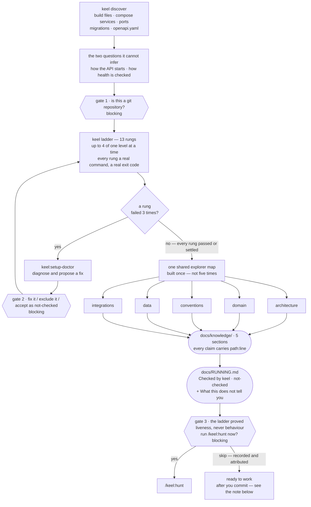
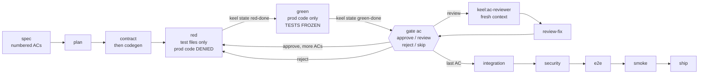
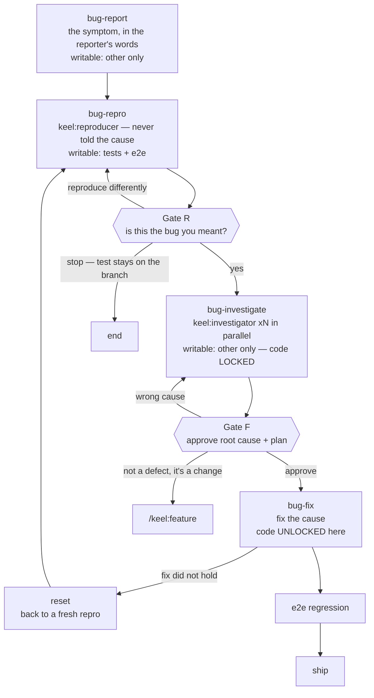
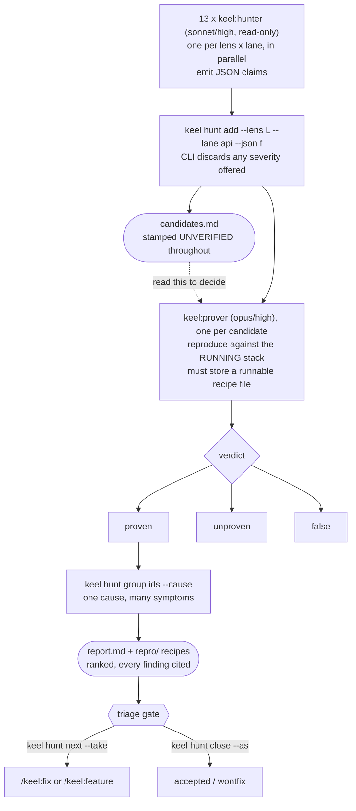

# The keel Reference

Every flow, every phase, every gate, every command, and the exact table that decides which files you
may write in which phase.

> **35 phases · 5 flows · 11 slash commands · 17 subagents · 10 hook events · 12 commit types ·
> 8 hunt lenses · 13 setup rungs · 10 human gates · 200 simulation scenarios.**

Companion documents: [`BACKLOG.md`](BACKLOG.md) is what is known to be missing and why.

**Contents**

| | | | |
|---|---|---|---|
| [0 Orientation](#0-orientation) | [4 keel:fix](#4-keelfix--the-clearest-interlock) | [8 Permission matrix](#8-the-permission-matrix--all-35-phases) | [12 Every gate](#12-every-human-gate-consolidated) |
| [1 keel:init](#1-keelinit--prove-the-machine-can-run-this-repo) | [5 keel:hunt](#5-keelhunt--find-what-you-did-not-know-about) | [9 Commit types](#9-the-12-commit-types) | [13 Every command](#13-every-command) |
| [2 keel:feature](#2-keelfeature--the-spec-flow) | [6 keel:ship](#6-keelship--finish-the-same-way-every-time) | [10 The 17 agents](#10-the-17-subagents) | [14 Refusals](#14-what-will-refuse-you-and-why) |
| [3 keel:change](#3-keelchange--work-without-a-spec) | [7 The rest](#7-the-rest-of-the-commands) | [11 The 10 hooks](#11-the-10-hook-events) | [15 Known gaps](#15-known-gaps) |

---

## 0. Orientation

keel is an **interlocking** wrapped around a coding agent. It does not advise the model to work in a
disciplined order — it makes the undisciplined order *unavailable*. The failing test must exist before
the production file is writable. The production file is locked until a fix plan is approved. The report
will not render while a single finding lacks a verdict.

### The three ideas

**1 — Enforcement lives in the CLI and the hooks, never in prose.**
A rule written into a prompt is a suggestion that decays as the context fills. A rule written into
`lib/guards.js` holds identically at turn 4 and turn 400. Everything in this document that *refuses* is
code; everything that *advises* is a subagent's verdict.

**2 — Every file belongs to exactly one bucket, and the phase decides the bucket's verb.**
Eleven buckets, four verbs: `allow`, `deny`, `new-only`, `delete-only`. The table fails closed — an
unlisted combination is `deny`, never "probably fine".

**3 — A human decision is recorded and attributed, not verified.**
keel cannot prove a person typed an approval. So each one carries `--by user` or `--by model`, and a
self-answer *prints and reports as one*. That is honest attribution, not a security boundary.

### Exit codes

| Code | Meaning |
|---|---|
| `0` | Fine. For a hook, stdout becomes context injected into the conversation. |
| `1` | You typed it wrong — bad usage, unknown subcommand, missing argument. |
| `2` | Hook-only: a hard block. stderr is shown to the model as the reason. |
| `3` | **A check refused.** The interesting one — the rule that fired is named, with the command that clears it. |

### The five flows at a glance

| Command | Use when | Starts at phase | Human gates |
|---|---|---|---|
| `/keel:init` | Once per repository, before anything else | `setup` | 3 |
| `/keel:change` | One file, criteria stated inline, no spec worth writing | `triage` | 2 |
| `/keel:feature` | More than one moving part — spec first | `spec` | 3+ |
| `/keel:fix` | A defect you can demonstrate | `bug-report` | 3 |
| `/keel:hunt` | "Are there bugs I don't know about?" | `hunt-scope` | 2–6 |

Choose by the *shape* of the work, not its size. A two-line change that alters an API response shape is
a feature; a forty-line change inside one function is a change.

---

## 1. `/keel:init` — prove the machine can run this repo

Detects the layout, asks the two questions it cannot infer, climbs a 13-rung ladder proving each run
step really works, then writes the runbook and the knowledge base.

Init exists because of one observation: an agent that cannot build the project will spend the session
inventing commands that look plausible. So init runs every command *for real*, once, and writes down
the ones that worked. After it, `docs/RUNNING.md` is a record of proof rather than a guess.

### What happens, in order

1. **Detect.** `keel discover` reads what the repo says about itself — build files, Compose services,
   scripts, ports, migration directories, the OpenAPI file.
2. **Ask the two runtime questions** it cannot infer from files: how the API is started, and how its
   health is checked.
3. **The git gate** — blocking, if there is no repository.
4. **Climb the ladder** — 13 rungs, up to `setup.max_parallel: 4` of one level at a time, each rung a
   real command with a real exit code.
5. **The knowledge gate** — which sections do you want? One `keel:librarian` per chosen section and
   no others, in parallel, every claim carrying a `file:line`.
6. **Write the runbook** — `docs/RUNNING.md`, including a section titled *What this does not tell you*.
7. **The audit gate** — blocking: the ladder proved liveness, never behaviour.



> Five librarians run in parallel off **one shared explorer map**, because the knowledge build — not
> the ladder — was 62% of a measured 14-minute init: five agents each reading the whole tree was the
> cost, and the map is what removes it. The three hexagons are the only points where init stops.

### The 13 rungs

A rung you exclude is marked `not-checked` in the runbook rather than hidden — a seven-rung run used to
look like a twelve-rung one.

| id | Label | What it proves |
|---|---|---|
| `git` | Git repository | There is a `.git`. See §15 — this is weaker than it looks. |
| `toolchain` | Toolchain | The JDK, Node and package manager the repo asks for are present at the right versions. |
| `dependencies` | Backend dependencies | Backend deps resolve. Relabelled *Build tool starts* in `--fast`, where it degrades to a `-q help` probe. |
| `dependencies-web` | Frontend dependencies | Frontend deps install from the lockfile. |
| `compile` | Both apps compile | The backend compiles. |
| `compile-web` | Frontend typecheck | `tsc` passes. |
| `unit-tests` | Unit tests | The existing suite passes *before* keel touches anything. |
| `testcontainers` | A container-backed test | Docker is reachable from the test JVM — catches a broken socket early. |
| `services` | Services up and healthy | `compose up -d --wait` — every dependency actually reaches healthy. |
| `api-boot` | API boots and is healthy | The backend starts and answers its health check. |
| `web-boot` | Frontend serves | The dev server serves a page. |
| `smoke` | Smoke check | The configured smoke command passes against the running stack. |
| `hooks` | Hook self-test | All ten hook events dispatch — enforcement is live in this repo. |

**When a rung fails.** A `keel:setup-doctor` agent diagnoses it and proposes a fix. After
`setup.fix_attempts_per_rung: 3` failures the rung stops retrying and becomes a **blocking question**
with three real answers: fix it, exclude it, or accept it as `not-checked`. Nothing is silently skipped.

### The three gates

**Gate 1 · no git repository — blocking**
> *"This directory is not a git repository. Initialise one before going further?"*

Without git, the runbook cannot be pinned to a commit, `verify arch` cannot tell which files changed,
changed-line coverage has no base to diff against, and `base_branch` is fiction. Before 0.9 this was a
footnote; it is now a question that stops the flow, because a footnote is what let a whole init produce
verdicts keyed to a commit that did not exist.

```
keel ask git-repo --answer "initialised" --by user
```

**Gate 2 · a rung failed three times — blocking**
> *"Rung `services` has failed three times. Fix it, exclude it, or accept it as not-checked?"*

Excluding a rung is legitimate — not every machine has Docker. Accepting it writes `not-checked` into
the runbook, so the next reader knows the difference between *passed* and *never asked*.

```
keel ask rung-services --answer "exclude, no docker here" --by user
```

**Gate 3 · behaviour was never checked — blocking, at the end**
> *"The ladder checked liveness only. Run /keel:hunt now to check behaviour?"*

Every rung answers *does it run*. Not one answers *does it do the right thing*. A project can pass all
13 rungs with an endpoint that returns 500 on every non-trivial input.

```
keel ask audit-now --answer "yes, run it" --by user
```

**Gate 4 · which knowledge sections — blocking**
> *"Which parts of the knowledge base do you want built?"*

Five librarians is the single most expensive thing init does — 62% of a measured 14-minute run — and
until 0.13 nothing asked which of them you wanted. `keel memory sections` prints the five with what
each is for and which already exist; `keel memory update` **refuses** until the question has an
answer, which is what makes it a gate rather than a courtesy.

```
keel memory sections                                       # the menu
keel memory sections --confirm conventions,data --by user  # build these two
keel memory sections --all | --none                        # all five, or none for now
```

Three states that genuinely differ: never asked (`update` refuses), `--none` (a real answer — the
five read `not selected`, which is a fact and not a problem), and a subset.

What a two-of-five knowledge base then looks like — and the reason this was impossible before 0.13:

```
$ keel memory check
knowledge base: every citation resolves.
  architecture  not selected
  domain        not selected
  conventions   1 citation(s), 0 proof(s)
  data          1 citation(s), 0 proof(s)
  integrations  not selected
$ echo $?
0
```

`not selected` contributes no problems, so the verdict passes and the push gate stays quiet. Before
0.13 those three rows read `missing`, the verdict failed, and **every push was blocked** until all
five existed — which is why `--fast` had to defer the knowledge base wholesale rather than build the
two sections that matter most.

**Re-run `/keel:init` to finish it later.** Confirming again *adds* to the selection: what is already
written is kept and is not rebuilt, and `--none` is refused while any section exists so a built one
cannot be orphaned. That is the intended way to build a knowledge base over more than one sitting.

One thing the selection does *not* do: **it never decides what gets checked.** A section on disk is
read back as project authority whether or not it was chosen, so an unsourced one is still refused.
Selection decides what must *exist*, never what may be *wrong*.

### The knowledge base

Five sections under `docs/knowledge/`, one `keel:librarian` each, all five in parallel:

- `architecture.md` — the style the code actually follows, and its import boundaries
- `domain.md` — the vocabulary, and which word means which table
- `conventions.md` — the house patterns, as they are, not as they should be
- `data.md` — the schema, the migrations, what is nullable and why
- `integrations.md` — every outbound call and what happens when it fails

**The citation rule, and its one honest limit.** Every claim carries a `path:line` that must resolve,
checked by `keel memory check`. A rule about validation, transactions or authorization needs its
citation to point into a **test** — or to carry the literal marker `unverified:`. This exists because of
a real incident: a librarian wrote `@Valid @Min(0) @Max(100)` on a `@RequestParam` into
`conventions.md` as the house pattern. Without `@Validated` on the class those annotations do nothing at
all, and the "house pattern" would have been copied into every new endpoint.

So: keel can tell whether a claim is *checkable*. It cannot tell whether it is *true*. A well-cited,
well-formatted, wrong sentence passes every gate.

### Fast mode

`keel ladder --fast` does **not** cut rungs. It removes duplicated work:

- **Implies `--resume`** — rungs that already passed on this machine are not re-run.
- **Degrades `dependencies`** to a `-q help` probe, because `compile` resolves the same dependency graph
  a moment later. The rung is relabelled *Build tool starts* so the runbook does not overclaim.
- **Records `keel memory sections --none`** — a real answer rather than a silence.

That last one used to be a *limitation* rather than a choice: a partial `docs/knowledge/` read as
*missing sections* to `keel memory check`, and a failing knowledge verdict blocks every push, so
two-of-five cost you the push gate. Since 0.13 the check is scoped to the selection, so a fast init
can now offer a **subset** instead of nothing.

Measured on a real repo, the full init was 14m11s: ladder 4m55s, knowledge **8m48s (62%)**, wrap-up 28s.

### What init writes

| Path | Contents |
|---|---|
| `.keel/config.yml` | Every command and directory keel will use, with the values init proved. |
| `docs/RUNNING.md` | The runbook: each step, the command, *Checked by keel* or `not-checked`, plus *What this does not tell you*. |
| `docs/knowledge/*.md` | The five sections above. |
| `.keel/setup.json` | Per-machine rung results — what `--resume` reads. |
| `CLAUDE.md` | A keel block telling future sessions which flow to use. |
| `.gitignore` | Seven per-machine paths appended if absent. |

> **Known defect — init does not commit its own output.** There is no `commit` anywhere in the init
> skill, so a successful init leaves all of the above uncommitted — and `keel preflight`, step 0 of
> every flow, refuses a tree that is not clean. Init closes by naming three flows to start, and none of
> them can start. Until it is fixed, run `git add -A && git commit -m "chore: keel init"` yourself.

---

## 2. `/keel:feature` — the spec flow

Fourteen phases. A spec with numbered acceptance criteria, then one criterion at a time: failing test,
then code, then a gate.

### Every phase, in order

| Phase | You do | Writable | Moves on with |
|---|---|---|---|
| `preflight` | Clean tree, checks pass, branch created | `other` | `keel preflight <slug>` |
| `workspace` | Stack up, lane chosen | `other` | `keel state phase spec` |
| `spec` | Interview, numbered ACs, ASCII mockup of four states, ASCII request path | `specs`, `other` | approval, then `keel commit docs` |
| `plan` | Files to touch, patterns to follow, order of ACs — written into the spec | `specs`, `other` | approval |
| `contract` | Change `openapi.yaml` first, regenerate the client | `contract`, `other` | `keel commit contract` |
| `red` | The failing test for one AC — **and nothing else** | `api-test`, `web-test`, `other` | `keel state red-done` |
| `green` | Minimum code to pass it — **tests are frozen** | `api-main`, `web-src`, `migration`(new), `other` | `keel state green-done` |
| `gate` | Present the AC and its evidence | `other` | `keel gate ac approve` |
| `review-fix` | Address a reviewer's blocking finding | all code + tests | `keel state phase gate` |
| `integration` | Wire the pieces together across ACs | `api-main`, `web-src`, `other` | `keel state phase security` |
| `security` | Two pipelines in parallel: auditor on the diff, triager on the deps | `other` | `keel state phase e2e` |
| `e2e` | Playwright specs for the E2E-tagged criteria | `e2e`, `other` | `keel commit e2e <AC>` |
| `smoke` | The always-on checks | `smoke`, `other` | `keel commit smoke` |
| `ship` | `/keel:ship` — see §6 | `other` | `keel gate final approve` |

### The AC loop



The two locks that make the loop mean something: in `red` the production file is denied, so a test
cannot be written against code that already exists; in `green` every test file is frozen, so a failing
test cannot be quietly softened into a passing one.

**Why freezing tests during green is the important one.** The most common way a TDD loop degrades is not
skipping the test — it is editing the assertion until it matches whatever the code does. That produces a
green suite, a clean diff, and no coverage of the behaviour anyone cared about. In `green`, `api-test`
and `web-test` are `deny`. If the test is genuinely wrong, the route is `keel gate ac reject` back to
`red` — visible, and recorded.

### Gate modes

`gates.mode` in `.keel/config.yml`:

| Mode | Stops | Use when |
|---|---|---|
| `every-ac` | Once per acceptance criterion. The default. | Normal work, and anything you have not done before. |
| `end-of-lane` | Once when the backend ACs are done, once for the frontend. | Two lanes running in parallel worktrees. |
| `end` | Once, at the end, for all of them. | A long mechanical feature you intend to review as one diff. |

Four decisions at the gate: `approve`, `review` (send a fresh-context `keel:ac-reviewer` first), `reject`
(back to `red`), and `skip`. **Skip is allowed, recorded in `gates.skipped`, and printed in the
pull-request body.** You can waive a gate; you cannot waive it quietly.

---

## 3. `/keel:change` — work without a spec

`keel triage "<description>"` proposes a size, and the size picks the route:

| Size | Route | Writable in that phase |
|---|---|---|
| `trivial` | Straight to `ship`. One commit, `keel commit trivial`. | `api-main`, `web-src`, `other` — plus test files **new-only** |
| `small-change` | Into the AC loop at `red`, criteria stated inline instead of in a spec file. | `other`, then the normal red/green locks |
| `spec` | Escalate — this wants `/keel:feature`. | — |

`trivial` is the one phase where production code and tests are writable together, and it is deliberately
narrow: new test files only, never edits to existing ones. A trivial change that needs an existing test
modified is not trivial.

**Escalation.** `keel check-size` looks at the branch as it stands and fires on the triggers: a contract
change, a migration, more than one lane, an auth-adjacent file, or the diff growing past the configured
size. Escalating mid-flight is `keel escalate`; overriding a fired trigger needs `--override "why"` and
that reason lands in the PR body.

---

## 4. `/keel:fix` — the clearest interlock

Eight phases, two gates, and one hard rule: production code stays locked until the bug exists as a
failing test and the fix plan has been approved.



Between `bug-repro` and `bug-fix` there are three phases in which `api-main` and `web-src` are `deny`.
The flow physically cannot fix a bug it has not demonstrated and explained.

**Why the reproducer is kept ignorant.** `keel:reproducer` is given the symptom and *not* the suspected
cause. An agent that knows the theory writes a test that confirms the theory — which passes once the
theory is implemented, whether or not the reported symptom is gone. A test that passes for the wrong
reason is worse than no test at all, because it reads as coverage and stops the next person looking.

**Gate R · the reproduction**
> *"Here is the failing test and its output. Is this the bug you meant?"*

Three answers: **yes** → investigate; **reproduce differently** → back to `bug-repro`; **stop** → the
flow ends. In all three the reproducing test stays on the branch, because a test that demonstrates a
real symptom is worth keeping even unfixed.

```
keel gate R approve   |   keel gate R reject --note "wrong endpoint"
```

**Gate F · the fix plan**
> *"Root cause, the evidence for it, the files to change, the risk, and one alternative considered. Proceed?"*

**Approving this is the act that unlocks production code.** The alternative is asked for on purpose: a
plan with no alternative is usually the first idea, not the best one. If the investigation concludes the
behaviour is intended, the route out is `gate-f → spec` — it was never a bug.

```
keel gate F approve
```

**Draining a backlog.** Fixing twenty findings from a hunt, both gates every time, is theatre.
`keel state start fix --no-gates` (or `gates.bug_gates: false`) auto-approves R and F, records each as
an automatic approval with `by: model`, and prints the waiver in the PR body. The reproduce-first
ordering still holds — what is waived is *your* reading of it, not the test.

---

## 5. `/keel:hunt` — find what you did not know about

Eight lenses fan out read-only, every candidate is proved against the running stack by a second agent
that never saw the claim being made, and nothing is fixed inside the hunt.

### The autonomy question comes first

With neither flag, `keel hunt start` **refuses** and raises a blocking question. How closely you
supervise is not a decision the model should inherit from a default.

> *"How closely do you want to watch this hunt? It is the one thing to decide up front."*

`--auto` is the old behaviour, now named: it runs through, pre-approving each phase gate with
`by: model`, so the record has the same shape either way and the report can say which gates a person
actually saw. `--semi` adds a stop at each of the three phases. Either way **nothing is fixed inside a
hunt** — the worst case for `--auto` is time spent and a thin report, which is why it is safe to run.

```
keel hunt start --semi   |   keel hunt start --auto
```

| Phase | `--auto` | `--semi` |
|---|---|---|
| `hunt-scope` | runs | runs |
| lens set | confirmed by the model, **marked unreviewed in both reports** | waits for you |
| `hunt-sweep` | runs | **gate sweep** — candidates rendered, then waits |
| `hunt-prove` | runs, batched at `hunt.prove_concurrency` | **gate prove** — waits before spending provers |
| `hunt-report` | runs; grouping shown, not prompted | **gate report** — grouping shown and confirmed |
| `hunt-triage` | always a gate | always a gate |

### The lens set — 8 lenses, 13 hunters

Most lenses are swept per *lane*, so each hunter reads half the tree. `contract-drift` is deliberately
not split — its entire subject is the disagreement *between* the two sides, so splitting it blinds it.

| Lens | Lanes | Looks for |
|---|---|---|
| `security` | api, web | Missing authorization, unvalidated input, data exposure, logic flaws that grant access. |
| `behavioral` | web, api | The code does something other than what the spec or the UI implies. |
| `technical` | api, web | Null paths, unhandled errors, resource leaks, wrong types crossing a boundary. |
| `concurrency` | api | Races, lost updates, non-atomic read-modify-write, missing transaction boundaries. |
| `idempotency` | api, web | Retried requests that double-charge, double-send, or double-insert. |
| `contract-drift` | both | Where the OpenAPI file, the backend and the frontend client disagree. |
| `test-integrity` | api, web | Tests that cannot fail: no assertions, disabled, tautological, mocking the thing under test. |
| `data-migration` | api | Migrations that lose data, are not reversible, or assume an empty table. |

**Gate · the lens set — enforced, not polite.** `keel hunt add` refuses every candidate until
`keel hunt lenses --confirm` has run. Fanning out first therefore wastes an entire sweep, so the cost of
ignoring the question is paid immediately rather than at the end.

```
keel hunt lenses --confirm security,technical,concurrency,contract-drift
```

### The two-stage bar — the whole product



A lens agent *proposes*; only a prover *measures*. The CLI throws away any severity a hunter offers,
because a severity is a measurement and at that point nothing has been measured.

Three rules make the bar real:

1. **No recipe, no proof.** `keel hunt prove --verdict proven` requires `--repro <file>`, a runnable
   recipe. An evidence paragraph is not a reproduction.
2. **No verdict, no report.** `keel hunt report` refuses while any candidate is still unjudged — so a
   hunt cannot end with "and there were probably others".
3. **A proven 5xx cannot be filed below `high`.** It is the one severity clause a program can check, and
   the refusal quotes the rubric back at you.

### Where a run lives on disk

```
# working state, per dated + numbered run
.keel/hunt/2026-09-20-01/run.json     lens set, gates, autonomy, candidates, verdicts
.keel/hunt/2026-09-20-01/incoming/    raw hunter JSON, as ingested
.keel/hunt/2026-09-20-01/repro/       recipes while being written

# the committed output
docs/hunts/2026-09-20-01/report.md      ranked, grouped, every finding cited
docs/hunts/2026-09-20-01/candidates.md  the pre-proof list, UNVERIFIED
docs/hunts/2026-09-20-01/repro/         the recipes the report cites
```

Dated and numbered because runs used to share one directory: ids restart at `F-001` each run, so a
second hunt overwrote the first one's proof recipes — destroying exactly the artifact that made the
first report trustworthy.

### The remaining gates

**Checkpoint · candidates — optional, never blocks.** `keel hunt report --candidates` renders the
pre-proof list, stamped UNVERIFIED throughout, so you can decide what is worth the provers' time. Skip
it and everything gets proved anyway. It is deliberately *never* gated, because it is what you read in
order to open the sweep gate.

**Gate · E2E coverage — blocking, when it fires.** Honest about what it detects: it matches a finding id
or a source basename against the specs, so it answers *"no spec references this"*, not *"this is
untested"*. A wrong *yes* would excuse a missing test; a wrong *no* only asks a question.

**Gate · triage — always, in both modes.** Findings leave one at a time through `/keel:hunt-next`,
which starts the right flow and **carries the repro recipe rather than the theory** — so the fix flow's
reproducer still gets the symptom, not the diagnosis.

```
keel hunt next --take   |   keel hunt close F-004 --as wontfix --note "..."
```

> **Bring the stack up first.** Run `keel stack up` before a hunt. Without it every prover returns
> `unproven` — and a page of `unproven` reads like *"no bugs found"* when it actually means *"nothing
> was running"*. A `--fast` init leaves the stack down, so this bites hardest exactly when you have just
> finished setting up. Also: nothing in `checkBash` inspects `DATABASE_URL`. **A prover can write to a
> real database.** Point a hunt at a disposable stack.

---

## 6. `/keel:ship` — finish the same way every time

1. `keel verify full` — compile, unit, module, contract, arch boundaries.
2. `keel verify coverage` — changed lines, not whole-project percentage. Gaps go to `/keel:cover`.
3. `keel audit --base main` — commit composition and test integrity across the branch: a `green` commit
   carrying a test edit, a disabled test, an assertion-free test.
4. `keel trace --strict` — every AC to its tests to its commits. An untraced AC is a hole in the story.
5. **Reviewers in parallel** — `keel:reviewer` once per lens (correctness, security, performance,
   architecture, assertions), each in a fresh context. Their verdicts *advise*; only the CLI blocks.
6. **Final review** — the one gate with no waiver.
7. `keel pr` — push and open the pull request.

**Gate · final review — never skipped**
> *"Spec, trace table, coverage delta, non-blocking findings, every unlock, every skipped gate,
> diffstat. Ship it?"*

`keel pr` is refused until this is recorded. Its value is mostly in the last two columns: the unlocks
and the skipped gates are where a branch quietly stopped following the rules, and this is the one place
they are all listed together.

---

## 7. The rest of the commands

**`/keel:diagnose` — for a bug you cannot reproduce yet.** Read-only. Fans out competing hypotheses in
parallel, each an agent told to try to *disprove* its own theory, and produces evidence plus a
reproduction recipe. Three exits: a recipe → `/keel:fix`; intended behaviour → `/keel:feature`; or an
honest "not determined", with what was ruled out. Nothing it does can change a file.

**`/keel:cover` — the coverage loop.** Groups the uncovered changed lines and asks one question per
group: `keel cover decide <key> test|delete|accept`. `delete` is a real answer — unreachable code should
go, not get a test. In `coverage-fix`, production buckets are **delete-only** so the loop can remove
dead lines but never add a line to make a number look better, and `e2e` is **deny** so it cannot reach
for a browser test to paper over a missing unit test.

**`/keel:review` — a review agent on demand.** The flow reviews at fixed points: the AC gate, phase 6.6,
ship and the final review. This runs the same agents in between. With no argument (or `code`) it runs
`keel:code-reviewer` over the branch diff. A lens name (`correctness`, `security`, `performance`,
`architecture`, `assertions`) runs one `keel:reviewer`, and `all` runs ship's whole lens set in parallel.
`ac AC-00n` runs `keel:ac-reviewer` on that criterion's commits. `--base <ref>` changes what the branch
diff is taken against. It is read-only and reports each finding in the agent's own words. A verdict
here does not move the phase, pass a gate or count as a ship review round. A fix still goes through
`review-fix`.

**`/keel:memory` — read the knowledge base back.** `keel memory sections`, `show`,
`--section <n>`, `check`, `update`. Use it after a `/clear`: cheaper and more reliable than re-deriving the architecture from the
tree. `check` is what the push gate consults.

**`/keel:status`.** `keel board` (aliased `keel status`) is the answer to "where am I" from anywhere —
flow, phase, ACs, agents in flight, stalls, flaky tests, and what currently blocks a push. `--watch`
keeps it live. `keel todos` gives the same thing as a checklist.

**The dashboard — every project on one page.** The `keel_dashboard` MCP tool opens a local page
(`http://127.0.0.1:7391`, or `KEEL_DASHBOARD_PORT`) that updates as the flow moves. There is one page per
machine, not one per session. The first session that opens it runs the hub, and every other session
hands back the same URL. The page opens on "all projects": one card per keel project with its flow, phase,
AC progress and a red mark when a blocking question waits on you. Click a card or a tab to see that
project's flow graph, criteria, agents, feed and push blockers.

The hub knows only the projects on the machine's list, `~/.keel/projects.json` (or `KEEL_HOME`). A project
joins the list when a session starts in it. It drops off when its `.keel/config.yml` is gone, when it has
not been seen for 14 days, or when you run `keel projects forget <name>`. Nothing is registered over
HTTP, and a request with a foreign `Host` header is refused. When the hub's session ends, any other session
that has opened the dashboard takes the port over within about ten seconds. The open page reconnects by
itself.

`keel projects` and the `keel_projects` tool list the same projects in text. Every other `keel_*` tool
takes `project: "<name>"` to look at a project other than the session's own.

**Reference skills the flows load.** Ten skills that contain no commands, only patterns:
`architecture`, `debugging`, `kotlin-spring-testing`, `playwright`, `security`, `spec-authoring`,
`web-implementation`, `web-testing`. They are why generated tests look like the house style rather than
like generic examples.

---

## 8. The permission matrix — all 35 phases

The actual table from `lib/guards.js`. This is the mechanism; everything else in this document is a
consequence of it.

### The eleven buckets

Every path is classified into exactly one bucket, first match wins, in this order:

| Bucket | Matches |
|---|---|
| `protected-env` | `guards.protected` globs — `.env` and friends. Denied in every phase. |
| `generated` | `guards.generated` globs — the API client, build output. Never hand-edited. |
| `contract` | `contract.file`, or any `openapi.{yaml,yml,json}`. |
| `specs` | Inside `specs.dir`. |
| `e2e` | Inside `e2e.dir`. |
| `smoke` | Inside `smoke.dir`. |
| `migration` | Inside the backend's migrations dir, or any `db/migration/`. |
| `api-test` | Inside `backend.dir` and test-shaped: `src/test/`, `src/integrationTest/`, `*Test.kt`, `*Tests.kt`, `test/`, `tests/`. |
| `api-main` | Inside `backend.dir`, not test-shaped. |
| `web-test` | Inside `frontend.dir` and test-shaped: `*.test.ts(x)`, `*.spec.ts(x)`, `test/`, `tests/`. |
| `web-src` | Inside `frontend.dir`, not test-shaped. |
| `other` | Everything else — docs, config, scripts. Writable in every phase. |

### The four verbs

- **`allow`** — create, edit, delete.
- **`deny`** — refused, with the phase named and the command that moves you on.
- **`new-only`** — may create a file; may not modify an existing one. Used for `migration` during
  `green`: a new migration is ordinary work, editing one that has shipped is a data-loss event.
- **`delete-only`** — may remove lines; may not add any. Used for production code during `coverage-fix`.

**It fails closed.** Every phase row begins `*: deny`. A bucket the row does not mention is denied — not
"probably fine". A new bucket added tomorrow is locked everywhere until somebody writes down where it
belongs, which is the correct default for a mechanism whose job is to refuse.

### Every phase and what it can write

`other` is `allow` in all 34 phases after `none`, so it is omitted below. Only `none` — outside any
flow — is `*: allow`.

| Phase | Writable beyond `other` | Flow |
|---|---|---|
| `none` | **allow everything** — keel governs flows, not the machine | — |
| `setup` | nothing | init |
| `preflight` | nothing | all |
| `workspace` | nothing | all |
| `triage` | nothing | change |
| `spec` | `specs` | feature |
| `plan` | `specs` | feature |
| `contract` | `contract` | feature |
| `red` | `api-test`, `web-test` | feature, change |
| `green` | `api-main`, `web-src`, `migration` *(new-only)* | feature, change |
| `gate` | nothing | feature, change |
| `review-fix` | `api-test`, `web-test`, `api-main`, `web-src`, `migration` *(new-only)* | feature |
| `integration` | `api-main`, `web-src` | feature |
| `security` | nothing | feature |
| `e2e` | `e2e` | feature, fix |
| `smoke` | `smoke` | feature |
| `coverage-fix` | `api-test`, `web-test`, `api-main` *(delete-only)*, `web-src` *(delete-only)*, `e2e` **deny** | cover |
| `trivial` | `api-main`, `web-src`, `api-test` *(new-only)*, `web-test` *(new-only)* | change |
| `small-change` | nothing | change |
| `bug-report` | nothing | fix |
| `bug-repro` | `api-test`, `web-test`, `e2e` | fix |
| `gate-r` | nothing | fix |
| `bug-investigate` | **nothing — the lock that matters** | fix |
| `gate-f` | nothing | fix |
| `bug-fix` | `api-main`, `web-src`, `migration` *(new-only)* | fix |
| `reset` | nothing | fix |
| `ship` | nothing | all |
| `final-review` | nothing | all |
| `memory` | nothing | all |
| `close` | `specs` | all |
| `hunt-scope` | nothing | hunt |
| `hunt-sweep` | nothing | hunt |
| `hunt-prove` | nothing | hunt |
| `hunt-report` | nothing | hunt |
| `hunt-triage` | nothing | hunt |

Read the five `hunt-*` rows together: **a hunt cannot modify a single line of source.** That is not a
policy in the skill text, it is five rows of a table. It is also why `--auto` is safe to let run.

**The escape hatch.** `keel unlock <path> --reason "..."` grants one exception, for the current phase
only, recorded in `state.unlocks` and printed in the final review. It exists because a mechanism with no
exception gets disabled wholesale the first time it is wrong; one that logs its exceptions stays on.

---

## 9. The 12 commit types

`keel commit <type> <ID> "<message>"`. It stages `git add -A`, then refuses if what is staged does not
match the type.

| Type | Prefix | Allowed buckets | Refused buckets |
|---|---|---|---|
| `red` | `test(ID)` | api-test, web-test, e2e | api-main, web-src |
| `green` | `feat(ID)` | api-main, web-src, migration, other | api-test, web-test |
| `refactor` | `refactor(ID)` | api-main, web-src, other | api-test, web-test |
| `fix` | `fix(ID)` | api-main, web-src, api-test, web-test, migration, other | — |
| `coverage` | `test(coverage)` | api-test, web-test, api-main, web-src | production code is **delete-only**, checked on the diff |
| `contract` | `contract(ID)` | contract, other | api-test, web-test |
| `e2e` | `e2e(ID)` | e2e | api-main, web-src, api-test, web-test |
| `smoke` | `test(smoke)` | smoke, other | api-main, web-src |
| `trivial` | `refactor(ID)` | api-main, web-src, other | — |
| `docs` | `docs(ID)` | specs, other | api-main, web-src |
| `memory` | `docs(memory)` | other | api-main, web-src, api-test, web-test, contract, migration |

Two of these carry reasoning worth knowing:

- **`coverage` lets production code through the bucket check on purpose** — so the `deleteOnlyProd` rule
  can then inspect the diff. Production files may *lose* unreachable lines in a coverage commit but
  never gain any.
- **`memory` exists because of ordering.** The knowledge base is regenerated *after* the reviewers have
  seen the code diff, so it cannot ride inside a reviewed commit — it needs a type of its own, and one
  that refuses every code bucket.

> **A known limit, stated plainly.** `keel commit` cannot stage selectively — it always does
> `git add -A` and then judges what happened to be dirty. Giving it a path argument would change what
> the bucket rules mean, so it does not have one. In practice: commit often, and do not leave unrelated
> work dirty.

---

## 10. The 17 subagents

Each runs in a fresh context with a narrow tool set. The read-only ones cannot write a file even if they
decide they should — that is in the frontmatter, not the prompt.

| Agent | Model | Writes? | Job, and why it is separate |
|---|---|---|---|
| `keel:explorer` | opus | no | Maps the code an AC touches and the patterns to follow. Several in parallel; one shared map feeds the librarians at init. |
| `keel:librarian` | opus | yes | One knowledge section, every claim with a `file:line`. Five in parallel at init. |
| `keel:test-author` | sonnet | yes | The failing tests for one AC — **without seeing the implementation plan**, so it tests the criterion rather than the intended code. |
| `keel:implementer` | sonnet | yes | Minimum code to pass one AC's failing test, fresh context. |
| `keel:reviewer` | opus | no | One lens at a time against the spec: correctness, security, performance, architecture, assertions. Fresh context is the point — it has not been persuaded by the work. Branch-scoped, at ship and in the coverage loop. |
| `keel:ac-reviewer` | opus | no | One acceptance criterion's two commits: is it met, does the test prove it, is the code good and consistent with the files it touches. Deliberately narrower and cheaper than `keel:reviewer`, because a review nobody runs catches nothing. |
| `keel:reproducer` | sonnet | yes | The smallest failing test for a reported bug, **from the symptom alone**, never told the theory. |
| `keel:investigator` | opus | no | Root cause from evidence. Read-only, so it cannot "just fix it" and skip Gate F. |
| `keel:hunter` | sonnet | no | Candidate bugs through one named lens, as machine-readable JSON. 13 in parallel during a sweep. |
| `keel:prover` | opus | recipes only | Tries to reproduce one candidate against the running stack. Returns proven / unproven / false with the exact commands. Read-only with respect to source. |
| `keel:security-auditor` | opus | no | The branch diff against the spec for security bugs and logic flaws. Pipeline A of the security phase. |
| `keel:dependency-triager` | sonnet | no | Whether a reported CVE is actually reachable from this codebase. Pipeline B — turns 40 advisories into the 2 that matter. |
| `keel:e2e-author` | sonnet | yes | Playwright specs, exploring the running app with playwright-cli rather than guessing selectors. |
| `keel:arch-surveyor` | sonnet | no | Which architecture style the code *actually* follows, when `keel arch detect` is unsure. |
| `keel:setup-doctor` | opus | no | Diagnoses a failing ladder rung — toolchain, Docker, Compose, ports, boot. |
| `keel:lane-runner` | sonnet | yes | Runs the frontend AC loop in its own worktree while the main session works the backend. Only when that lane's gates are skipped. |
| `keel:bulk-reader` | haiku | no | One specific question about large files, answered as short bullets with line numbers. The cheap way to avoid a whole-file read. |

`keel models set-all sonnet --effort high` sets the model and reasoning effort across all seventeen by
rewriting their frontmatter. `keel models show` prints the current assignment. `maxTurns` and `tools`
are not yet reachable this way (§15).

> **Verdicts advise; the CLI blocks.** Every agent returns a structured verdict against one contract in
> `lib/hooks.js`, and a `SubagentStop` hook checks the shape. But an agent saying "this is unsafe" does
> not stop anything — it becomes advice in the conversation and a line in the final review. The only
> things that *refuse* are the guard matrix, the commit rules and the verify gates. Enforcement is
> deterministic or it is not enforcement.

---

## 11. The 10 hook events

Registered in `hooks/hooks.json`, all dispatched through `keel hook <event>`. This is where enforcement
actually touches the session.

| Event | What keel does with it |
|---|---|
| `SessionStart` | Injects the current flow, phase, AC and next step, so a resumed session knows where it stands without being told. |
| `PreToolUse` | **The block.** Classifies the target path, looks up phase x bucket, exits 2 with the reason if the verb is `deny`. Also screens Bash commands and MCP tool names. |
| `PostToolUse` | Secret scanning at the moment of writing — before a secret can reach a commit. Flags a newly disabled or skipped test. |
| `PostToolBatch` | Batch-level checks that only make sense after several edits land together. |
| `PostToolUseFailure` | Feeds the stall counter. Repeated identical failures are fingerprinted, which is what makes `keel stall` able to say "you have tried this four times". |
| `Stop` | Refuses to end the turn mid-phase with `{"decision":"block"}` — e.g. stopping in `red` with no failing test, or in `gate` with no decision recorded. |
| `SubagentStart` | Records the agent in `state.agents` so `keel board` can show what is in flight. |
| `SubagentStop` | Validates the verdict against the agent's contract. A malformed verdict is reported rather than silently believed. |
| `FileChanged` | Notices changes made outside the tool loop — an external editor, a script. |
| `Notification` | Surfaces blocking questions so a `keel ask --blocking` cannot be missed. |

`keel doctor --hooks` runs all ten and reports 10/10 — worth doing after any install, since a plugin
whose hooks are not wired is a plugin that enforces nothing while appearing to work.

> **Two real holes in the hook layer.**
>
> **A hook cannot bind a subagent to a path subset.** The payload carries no instance id, so scope is
> forced at the ingest instead of at the write.
>
> **The MCP name heuristic leaks.** `checkMcp` judges tools by name pattern. Measured inside a live
> flow: it refuses `terminal_execute`, `workflow_execute`, `hooks_post-edit` and `task_create`, and
> **allows** `agent_spawn`, `swarm_init`, `memory_store` and `neural_train` — because
> `spawn|init|store|train` are not in its `writeish` pattern. There is no `mcp.deny` list yet. Outside a
> flow (`phase: none`) every MCP tool is allowed by design.

---

## 12. Every human gate, consolidated

Ten gates plus one optional checkpoint. Everything not listed here runs without asking you.

| Gate | Flow | Command | Waivable? |
|---|---|---|---|
| Autonomy — `--auto` or `--semi` | hunt | `keel hunt start --semi` | no — refuses to start |
| Lens set confirmation | hunt | `keel hunt lenses --confirm ...` | self-answer in `--auto`, marked unreviewed |
| Sweep gate | hunt `--semi` | `keel hunt gate sweep approve` | pre-approved in `--auto` |
| Prove gate | hunt `--semi` | `keel hunt gate prove approve` | pre-approved in `--auto` |
| Report gate | hunt `--semi` | `keel hunt gate report approve` | pre-approved in `--auto` |
| E2E coverage question | hunt | `keel ask e2e-cover --answer ...` | answerable either way |
| Triage | hunt | `keel hunt next --take` | no |
| Gate R — the reproduction | fix | `keel gate R approve` | `--no-gates`, recorded in the PR |
| Gate F — the fix plan | fix | `keel gate F approve` | `--no-gates`, recorded in the PR |
| Per-criterion gate | feature, change | `keel gate ac approve` | `skip`, recorded in the PR |
| Spec approval | feature | — | no — `contract` and `red` come after it |
| Plan approval | feature | — | no |
| Final review | all | `keel gate final approve` | **never** |
| git repository | init | `keel ask git-repo --answer ...` | answerable either way |
| Rung failed x3 | init | `keel ask rung-<id> --answer ...` | answerable either way |
| Knowledge sections | init | `keel memory sections --confirm ...` | no — `memory update` refuses |
| Behaviour unchecked | init | `keel ask audit-now --answer ...` | answerable either way |
| *Candidates checkpoint* | hunt | `keel hunt report --candidates` | never blocks by design |

**How a blocking question behaves.** `keel ask <id> --question "..." --blocking` writes to
`.keel/questions.json`; `keel ask pending` lists what is open; the `Notification` hook surfaces it; and
the flow will not proceed past it. Answering is `keel ask <id> --answer "..." --by user`.

`--by` defaults to `model`, and when the model answers its own question the output says *"recorded as a
self-answer"*. That phrasing is the whole point: a self-answered blocking question is not a gate that
was passed, it is a gate that was noted.

---

## 13. Every command

```
Flows and state
  keel init [--write] [--new] [--refresh] [--dev-container]
  keel state show|start|phase|ac      inspect or move the flow state
  keel state red-done                 confirm a real RED for the current AC
  keel state green-done               confirm the AC and suite are green
  keel state repro-done               confirm a bug reproduction
  keel gate <ac|R|F|final> <decision> record a human gate decision
  keel escalate [--override "why"]    turn a small change into a spec flow
  keel board [--watch] [--for <s>]    tasks, agents in flight, what blocks a push
  keel status                         alias for keel board
  keel todos [--json]                 the flow's steps as a checklist
  keel stall [reset]                  repeated-failure counter and the stall ladder
  keel projects [forget <name>]       every keel project on this machine, as the dashboard shows them
  keel ask <id> --question "..." [--blocking] | --answer "..." [--by user]
  keel ask list|pending|clear <id>    questions keel will not proceed past
  keel models show|set-all <model> [--effort low|medium|high]

Project setup
  keel preflight <slug>               prove the machine is ready, then create the branch
  keel discover                       what the repo says about how it runs
  keel ladder [--plan|--resume|--fast]  prove every run step, write docs/RUNNING.md
  keel scaffold [compose|dev-container|playwright|smoke|spec|claude-md|all]
  keel stack up|down|status|logs|migrate|reset [--lane web]
  keel lane start|status|merge <name> [--background]
  keel arch detect|show|set <style>   architecture style and its import boundaries
  keel memory sections [--confirm a,b|--all|--none]    which sections to build
  keel memory show|reload --section <n>|check|update

Checks and commits
  keel verify fast|ac|arch|deps|module|contract|full|e2e|release|coverage
  keel cover [decide <key> test|delete|accept]  the coverage-fix loop
  keel spec check|show [--path]        spec gaps, and its ASCII drawings
  keel commit <type> <ID> "<msg>"     stage and commit with phase rules enforced
  keel trace [--strict]               AC to tests to commits
  keel audit [--base main]            commit composition and test integrity
  keel unlock <path> --reason "..."   one-phase exception, logged
  keel env                            required variable names and whether they are set
  keel smoke                          run the smoke checks
  keel pr [--dry-run]                 checks, then push and open the PR
  keel triage "<description>"         size proposal for /keel:change
  keel check-size                     escalation triggers on the current branch

Bug hunt
  keel hunt start --auto|--semi [--scope all|diff|<paths>] [--lenses a,b,c] [--fast]
  keel hunt lenses [--confirm a,b,c]  the lens set; confirming it opens the sweep
  keel hunt add --lens L --lane api|web|both --json <f>
  keel hunt candidates [--batch]      the next batch of candidates to prove
  keel hunt prove <id> --verdict proven|unproven|false --evidence "..." --repro <f>
  keel hunt group <id...> --cause "..."  one cause, many symptoms
  keel hunt gate sweep|prove|report approve|reject [--by user]
  keel hunt report [--candidates]     the report, or the unverified candidate list
  keel hunt next [--take]             the top group, and the command to start it
  keel hunt close <id> --as fixed|accepted|wontfix --note "..."
  keel hunt list [--open] [--lens L]  the backlog
  keel hunt status                    counts, groups, and what blocks the report
  keel hunt resume                    where you were, and the next command

Simulation and hooks
  keel simulate [name] | --sandbox    run the built-in scenarios, or keep a sandbox repo
  keel doctor [--hooks]               environment and hook self-test
  keel hook <event>                   hook dispatchers (used by hooks/hooks.json)
```

### The ten verify checks

| Check | Runs |
|---|---|
| `fast` | Compile plus the affected module's tests. The one to run constantly. |
| `ac` | Only the tests tagged with the current acceptance criterion. |
| `arch` | Import boundaries for the detected architecture style. |
| `deps` | Dependency advisories. Feeds `keel:dependency-triager`. |
| `module` | One module's full suite. |
| `contract` | Backend, generated client and `openapi.yaml` still agree. |
| `full` | Everything but E2E. |
| `e2e` | Playwright, against the running stack. |
| `coverage` | **Changed lines**, not project percentage. Writes a sha-keyed verdict. |
| `release` | The full pre-PR set. |

### Recovering your place

| Command | Answers |
|---|---|
| `keel status` | Flow, phase, ACs, agents in flight, what blocks a push. |
| `keel todos` | The flow's steps as a checklist, current one marked. |
| `keel hunt resume` | Which lens x lane pairs are still owed, which gate is waiting, the next command. |
| `keel ladder --resume` | Re-runs only the rungs that have not passed on this machine. |
| `keel ask list` | Every question, answered or open, and who answered it. |
| `keel memory check` | Whether every knowledge claim still resolves to a real line. |
| `keel stall` | The repeated-failure count, and the four-step ladder out of it. |
| `keel doctor --hooks` | Environment, 10/10 hook self-test, any shadowing install. |
| `keel state abort` | Clears the flow. A hunt backlog survives it — deliberately a file of its own. |

### The stall ladder

When the same failure fingerprint repeats, `keel stall` stops offering another attempt and starts
walking up:

1. Re-read the trimmed failure and the acceptance criterion; do not guess.
2. Ask `keel:investigator` for a fresh-context diagnosis before the next attempt.
3. Step the model up (`/model opus`, or Fable if the cause stays ambiguous).
4. Stop and ask the user — the failure, what was tried, and the two options you see.

---

## 14. What will refuse you, and why

Every one of these is exit code 3 and names the command that clears it. None is a wall.

| Refusal | Because |
|---|---|
| An edit to a file frozen by the current phase | Phase x bucket says `deny`. The message names the phase and the transition out. |
| A push while the coverage verdict is missing or stale | Verdicts carry the `sha` they were computed at. Yesterday's pass does not cover today's code. |
| A push while a lockfile changed and the dependency verdict is stale | Same rule, triggered by the lockfile rather than the clock. |
| A push while `keel memory check` fails, if a knowledge base exists | A stale knowledge base is worse than none: it is confidently wrong. |
| `keel memory update` before the sections are chosen | The knowledge gate's teeth. Five librarians is not a default anyone should inherit. |
| `keel memory sections --none` while a section exists | A file on disk is still read back as authority; deselecting it would orphan it. |
| A `green` commit with a staged test file | That is the exact shape of "I edited the test until it passed". |
| A `red` commit with staged production code | Then the test was never red for the right reason. |
| A bug fix before the bug exists as a failing test | `bug-investigate` denies `api-main` and `web-src`. |
| A hunt report while any candidate has no verdict | A report with unjudged claims is a list of rumours. |
| A proven finding with no `--repro` file | An evidence paragraph is not a reproduction, and only a recipe can be replayed later. |
| A proven 5xx filed below `high` | The one severity clause a program can check; the refusal quotes the rubric. |
| A knowledge claim whose citation does not resolve | Every claim carries `path:line`. Rules about validation, transactions or authorization must cite a *test* or carry `unverified:`. |
| Candidate ingestion before the lens set is confirmed | The lens gate's teeth: otherwise the question could be ignored for free. |
| `keel hunt prove`/`candidates` before the sweep gate, in `--semi` | The phase gates, enforced in the hunt commands rather than in the generic phase machine. |
| `keel pr` before the final review is recorded | The one gate with no waiver. |
| A phase transition that is not in the transition table | `--force` exists and is recorded in the PR body. |
| A secret, at the moment it is written | `PostToolUse` scans before it can reach a commit. |
| A newly disabled or skipped test | Caught three times: at the edit, at the commit, and in `keel audit`. |
| Ending the turn mid-phase | The `Stop` hook — e.g. in `red` with nothing failing, or in `gate` with no decision. |
| A hand-edit to generated code or a merged migration | `generated` is denied everywhere; `migration` is `new-only` at best. |
| Any write to a `protected-env` path | Denied in every phase, with no unlock path. |

---

## 15. Known gaps

From [`BACKLOG.md`](BACKLOG.md). Several obvious-looking improvements there are deliberate trades with
reasons attached; re-deriving them wastes a session.

### Defects found, not fixed

**Init does not commit its own output** — so `keel preflight` refuses after a successful init, and the
three flows init recommends cannot start. The fix is one `keel commit docs` at step 7 — but it must land
*after* the git-rung fix below, because `git add -A` in a repo whose project is untracked would sweep
the entire codebase into a docs commit.

**The `git` rung passes on a repository with zero commits** — `verify.hasGit` is
`git rev-parse --git-dir`, "is there a `.git`", not the question keel depends on, which is "can a
verdict be keyed to a commit". Seen in the field: a repo on `main` with zero commits and 19 untracked
entries, because someone ran `git init` to answer keel's own question and stopped there. Every verdict
written after that carries a placeholder sha that can never match HEAD, so the coverage, dependency and
knowledge push gates are permanently unsatisfiable. The hunt id `2026-09-20-unknow` was `'unknown'`
sliced to six characters.

**The MCP heuristic lets an orchestrator through** — detailed in §11. No `mcp.deny` list exists yet.

### Designed, not built

**`keel hunt regress`** — the highest-value item here. Replay the stored recipes of every finding closed
as `fixed`. Those recipes are already runnable, committed artifacts sitting next to the report, so a bug
that comes back is caught by the exact proof that caught it the first time. Needs no new dependency.

**ruflo as an index, never as the record** — `docs/knowledge/` stays the source of truth (cited,
committed, checkable, sha-versioned) and is indexed into ruflo *after* `keel memory check` passes. The
principle: **ruflo may remember; keel must still prove.** Replacing the directory with a vector store
was considered and rejected: it drops the citation check, the PR-diff reviewability and the
sha-versioning, and would not save the time anyway, because the cost is five agents reading the tree
rather than the file writes.

**`keel models` cannot reach `maxTurns` or `tools`** — `model` and `effort` are settable by the same
frontmatter-rewriting mechanism that would cover the other two.

### Shipped in 0.13.0

**The human gate on the knowledge build**, and its prerequisite — **`memory check` scoped to the
selection**. Both were in this section until 0.13; they are described in §1.

### One untested inference

A ruflo-spawned agent runs inside ruflo's process, not Claude Code's tool loop, so its writes should
never reach `PreToolUse` — which would mean keel's phase matrix never sees them, and a swarm running
during `green` could rewrite the frozen tests keel exists to protect. This follows from where the
process boundary sits. **It has not been tested.** Confirming it takes about five minutes: start a flow,
reach `green`, have a ruflo-spawned agent edit a frozen test file, and watch whether the edit is refused.

### Limits kept on purpose

Recorded so none is mistaken for an oversight:

- `init --write` overwrites a hand-edited config.
- `keel commit` cannot stage selectively.
- A prover can write to a real database.
- E2E detection answers "no spec references this", not "this is untested".
- Severity is model-judged apart from the 5xx floor.
- Nothing proves a human answered a question.
- A hook cannot bind a subagent to a path subset.
- Outside a flow every MCP tool is allowed.
- A fast init leaves the stack down.
- **keel cannot tell whether a knowledge claim is true, only whether it is checkable** — a well-cited,
  well-proven, wrong sentence passes every gate.

---

*keel 0.13.0 · Kotlin/Spring Boot + TypeScript. Every table here was read out of the installed copy
rather than remembered. **The one-sentence version:** keel makes the wrong order unavailable, and stops
at ten places to ask you the questions a program cannot answer.*
