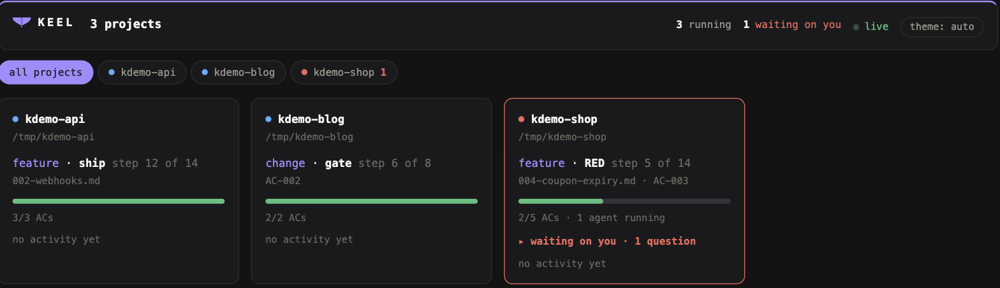

# Dashboard

keel has a live dashboard: one local web page for **every keel project on your machine**.

Run `keel dashboard`, ask Claude to open it (the `keel_dashboard` MCP tool), or open
`http://127.0.0.1:7391` yourself. `keel dashboard --demo` shows it with example data, without a
project to point at.



```
Session A (shop) ─┐
Session B (blog) ─┼──► ~/.keel/projects.json ──► one hub on :7391 ──► all projects
Session C (api)  ─┘
```

## What you see

- **All projects.** One card per project: its flow, phase ("step 3 of 15"), acceptance-criteria progress, and a red mark when a question is waiting on you.
- **One project.** Click a card or a tab: the flow as a state-machine graph (you are here, where you may go next), the criteria, the RED/GREEN/GATE loop, running agents, a live tool feed, what is frozen, and what blocks a push.
- **The map.** `keel map build` derives what the project actually exposes and the dashboard draws
  it: the whole system, the business flow, the modules, the classes inside one module, and the
  database schema (`--view map` or `--view er`).
- **Theme.** The `theme:` button in the header cycles auto → light → dark. Your choice is kept in that browser.

## How the hub works

- The first session that opens the dashboard runs the hub. Every other session hands back the same URL.
- A project joins the list when a Claude session starts in it. It leaves when its `.keel/config.yml` is gone, after 14 days unseen, or with `keel projects forget <name>`.
- If the hub's session closes, another session that has opened the dashboard takes the port over within about ten seconds, and the page reconnects by itself.
- It listens on localhost only, refuses foreign `Host` headers, and nothing can register a project
  over HTTP. It is read-only unless you turn the console on — see below.

## The map, and what it admits it cannot read

`keel map build` writes `.keel/map.json` from three readers: the API contract, the migrations in
applied order, and the source declarations. It is keyed to a commit **and** to a hash of the sources
it read — keyed to the commit alone, a map rebuilt from edited sources would read as current, and
one nobody rebuilt would re-stamp itself on every commit.

Every derivation states its limit on screen: a path behind a `$ref`, a queue name assembled at
runtime, a module grouped by endpoint prefix because no role directories exist. Each is counted and
named, because a map that quietly under-reports is worse than one that says so — a silent drop reads
as "this project has no such endpoint", which is a lie.

`keel map check` re-resolves every citation and fails on one that no longer lands. A map older than
HEAD is drawn dimmed and says what it knows is missing, rather than being quietly wrong.

Languages the declaration reader knows: Kotlin, Java, TypeScript, JavaScript, PHP and Python. A
single-module project — `backend.dir: ''`, meaning the module *is* the repository root — is read
like any other; it used to draw zero classes and say nothing about why.

Stacks whose migrations are not SQL dump a snapshot instead, and keel parses that. See
[Stacks](Stacks) for `keel tools run schema-dump`.

## Tools

The panel lists every program keel runs for this project — formatter, analyser, CI probe — where
each is declared, and how the last run went.

```
keel tools list                   keel tools run ci
```

A tool exists so the *agent* does not pay for output twice. Asking a model to run `gh run list` and
read it pulls pages of text into a context window that then holds it all session; `keel tools run`
prints the verdict — exit code, duration, a trimmed head — and the full output goes here, where a
person reads it for free.

`ci` and `pr-checks` ship as defaults. They use `gh` because that is what keel already detects; a
GitLab project overrides one `run:` line (`glab ci list`) and nothing else changes.

## The console — off until you turn it on

The dashboard can call an endpoint, query the database read-only, or run a command named by key from
your config. All of it is **off by default and off again after an upgrade**, because a page you have
open in another tab can POST to localhost even without reading the response.

Five gates guard every action: the config switch, a host that must be loopback or a compose service,
SQL that must be a single read, and a command that is named by key — never written out — and still
passed through the same phase guard the rest of keel uses. Everything that runs lands in the event
log; a power that leaves no trace is the actual escalation.

Turn it on per project under `console:` in `.keel/config.yml`.

## MCP tools

| Tool | Answers |
|---|---|
| `keel_status` | the whole board for a project |
| `keel_projects` | every project, one line each |
| `keel_next` | the single next action |
| `keel_timeline` | what just happened |
| `keel_explain` | what a phase allows and refuses |
| `keel_dashboard` | the dashboard URL |

Every tool takes `project: "<name>"`, so one session can ask about another.

## Settings

| Variable | Default | Effect |
|---|---|---|
| `KEEL_DASHBOARD_PORT` | `7391` | the hub's port |
| `KEEL_HOME` | `~/.keel` | where the project list lives |
