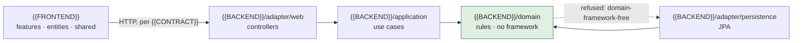

# Architecture

Style: **{{ARCH_STYLE}}** ({{ARCH_CONFIDENCE}}, {{ARCH_SOURCE}}) — detected at `{{COMMIT}}`.

<when `hybrid_with` is set, say which style prevails in which directory, and that neither is being migrated>

## Modules

| Module | Style | What it owns |
|---|---|---|
| `{{BACKEND}}` | {{BACKEND_STYLE}} | <one line> |
| `{{FRONTEND}}` | {{FRONTEND_STYLE}} | <one line> |

## The graph

<Generated from `architecture.modules` and `boundaries.rules`. An arrow is "may import"; a
crossed-out arrow is a rule in `boundaries.rules`. Keep it to the boxes that constrain a
placement decision — a diagram of every package is noise.>

## Boundaries in force

<One row per rule in `boundaries.rules`. `enforce` is off, warn or block; `keel verify arch`
greps the import lines of changed files only, so an inline fully-qualified reference and a
dynamic import both slip past it.>

| Rule | From | Refused imports |
|---|---|---|
| {{RULE_NAME}} | `{{RULE_FROM}}` | `{{RULE_DENY}}` |

Enforcement: `{{BOUNDARIES_ENFORCE}}`.

## Where a new thing goes

<Three or four lines only, naming real packages: a new endpoint, a new rule, a new query,
a new screen. The `keel:architecture` skill holds the full reasoning for this style —
point at it rather than restating it.>
